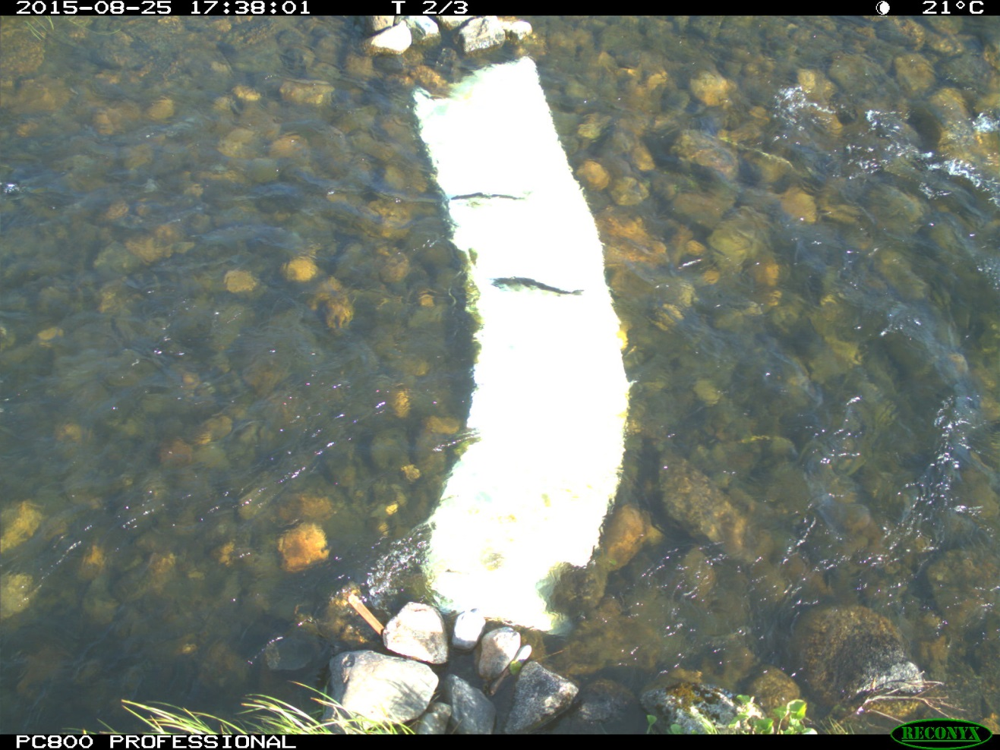
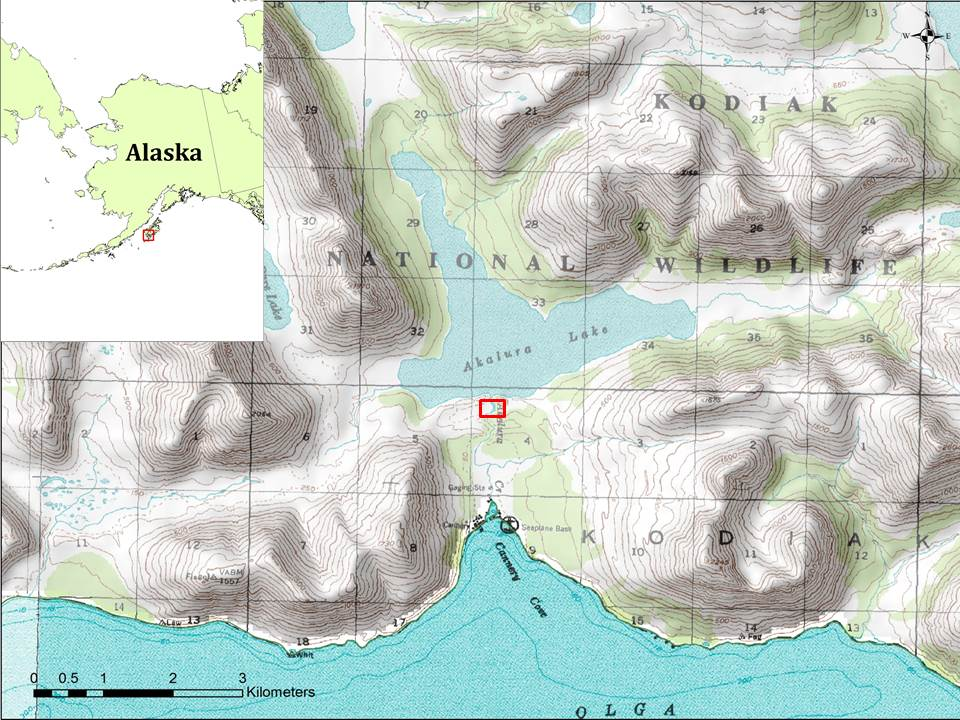
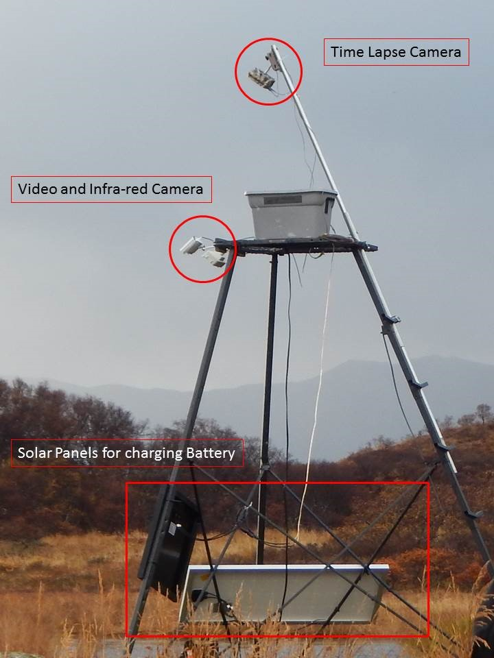

```{r setup, include=FALSE, cache=FALSE}
knitr::opts_chunk$set(echo = TRUE, 
                      warning = FALSE,
                      message = FALSE,
                      fig.pos = "!ht")

# knitr::knit_hooks$set(inline = function(x) {  # Add comma separator to 4-digit numeric values
#   prettyNum(x, big.mark=",")
# })
```

```{r import-data, echo=FALSE, include=FALSE}
dat <- suppressWarnings(import_format(params$input_data))
```

```{r analysis, echo=FALSE, include=FALSE}
models <- model_escapement(dat)
dat$escapement <- stats::predict(models$top_model, dat)
boots <- boot_escapement(dat, models)
```

```{r daily-summary, echo=FALSE, include=FALSE}
dat_daily <- dat %>%
    dplyr::mutate(day = as.Date(date),
           escapement = stats::predict(models$top_model, dat)) %>%
    dplyr::group_by(day, year) %>%
    dplyr::summarize(escapement = sum(escapement)) %>%
  dplyr::ungroup()

peak <- dat_daily %>%
  dplyr::filter(year == max(dat_daily$year)) %>%
  dplyr::filter(escapement == max(escapement, na.rm = T))
```


```{r peak, echo=FALSE, include=FALSE}
peak <- dat_daily %>%
  dplyr::filter(year == max(dat_daily$year)) %>%
  dplyr::filter(escapement == max(escapement, na.rm = T))
```

---
title: |  
  | `r params$title`  
  |   
  | `r params$subtitle`  
  |   
  |   
author: |  
  | `r params$refuge`
  |   
  | `r params$author`
  | `r params$email`
---

\newpage

# Abstract {-}
A time-lapse photography and video recording system were used to enumerate adult sockeye salmon (*Oncorhynchus nerka*) entering Akalura Lake. In `r max(dat$year)`, the system was installed on `r format(min(subset(dat$date, dat$year == max(dat$year))), "%d %B, %Y")` and operated through `r format(max(subset(dat$date, dat$year == max(dat$year))), "%d %B, %Y")`. The time-lapse photography camera recorded 3 sequential pictures at the start of each minute for the duration of the project. Following a double-sampling protocol, a `r tolower(models$aic_table$Modnames[[1]])` model of the relationship between time-lapse and video counts was found to be the most parsimonious mode to predict salmon passage across the season. In `r peak$year`, estimated daily salmon passage peaked at `r round(peak$escapement, 0)` on `r format(peak$day, "%B %d, %Y")` and by the end of the season a total of `r round(last(boots$summary$escapement), 0)` (95% CI=`r round(last(boots$summary$lower_ci), 0)`--`r round(last(boots$summary$upper_ci), 0)`) sockeye were estimated to have migrated into Akalura Lake.

# Introduction {-}
Management of salmon within the Kodiak Management Area (KMA) is the responsibility of Alaska Department of Fish and Game (ADF&G) who monitors escapement on many systems within Kodiak Refuge boundaries. Escapement goals for KMA salmon stocks are based on the Policy for the Management of Sustainable Salmon Fisheries (SSFP; 5 AAC 39.222) and the Policy for Statewide Salmon Escapement Goals (EGP; 5 AAC 39.223). These policies were adopted by the Alaska Board of Fisheries in 2000 and 2001, respectively, to ensure the state’s salmon stocks would be conserved, managed, and developed using the sustained yield principle. Escapement information provides the basis for ensuring biological integrity, and is the foundation for in season management actions that regulate commercial, sport, and subsistence harvest of salmon (Spalinger 2006). Historical studies have documented salmon utilizing over 800 systems within the KMA (Johnson and Keyse 2013), but only about 49 support yearly sockeye salmon spawning populations (Johnson and Blanche 2010). Of these 49, escapement is monitored in only 10 systems. During the annual review of escapement goals in 2005 by ADF&G, the Akalura, as well as Uganik and Little Rivers, escapement goals were eliminated. The elimination of these goals was based on reliable escapement estimates not being consistently collected due to budget constraints (Nelson et al. 2005).  

Sockeye salmon data/information has been collected on Akalura Lake intermittently starting in 1923 (Edmundson et al 1994), with the most recent study being conducted in 2002 (Sagalkin 2003). Historical data (1992-2003) shows that at one time the Akalura sockeye salmon run was a bi-modal population with a small early run occurring in June. But over time the early run has disappeared. This system has been monitored from 1944 to 1958 and from 1987 to 2002, but due to lack of funding there was a 29-year period where no escapement data was collected. To help fill this data gap, we will provide the results from this study to ADF&G to aid in their management of sockeye salmon in the Alitak District. The lack of recent escapement data is not only a problem for managers focused on sustainable yield but also the energy and nutrients in spawning salmon provide critical inputs into riparian and terrestrial ecosystems (Wipfli and Baxter, 2001; Willson and Halupka, 1995). Thus, it is also important for Kodiak National Wildlife Refuge managers to have accurate escapement data to assess whether escapement is sufficient to maintain historical ecosystem productivity and function as well as subsistence needs.  

# Study area {-}
Akalura Lake has a surface area of 4.9 km^2^, a mean depth of 9.9 m, and a maximum depth of 22 m (Schrof et al. 2000). There are four main creeks that drain into the lake: Mud Creek, Falls Creek, Eagle Creek, and Crooked Creek (Edmundson et al. 1994). The outlet stream (Akalura Creek) is 1.9 km long and drains into a small saltwater lagoon before entering Olga Bay. Akalura Creek is a small, clear water creek and has a single 2.8 km tributary (Humpy Creek) (Figure \@ref(fig:study-area)).

```{r study-area, fig.cap="Location of Akalura Lake and the associated weir, Kodiak, Alaska.", echo=FALSE, out.width="75%"}

```

# Methods {-}
Managers utilize several different methods, each with their own strengths and weaknesses, to monitor salmon escapement and passage. Examples of these methods include fixed or floating weirs, counting towers, or sonar, and aerial surveys which are used on many large rivers in Alaska. Although these methods collect the desired information, they are expensive and are relatively labor intensive. On small streams (<15 m wide), remote video methods can collect comparable data and are less expensive and labor intensive; however, the time required to review video footage can be prohibitive. To quantify the sockeye salmon run in Akalura River, a double-sampling time-lapse photo and video camera system approach was used (Deacy et al. 2016). This method was developed and tested in 2012, and refined from 2013--2015 on 11 streams in southwest Kodiak, Alaska. The system has the benefits of a remote video system (i.e., low maintenance, low impact on passing salmon, inexpensive, and accurate counts), but labor costs for reviewing photo images is greatly reduced.

In an effort to utilize a remote camera system without time-consuming video enumeration, we utilized a double-sampling scheme. Double sampling is used when the variable of interest is expensive to quantify, but another variable is easily measured and has a predictable relationship with the variable of interest, (Cochran 1977). For our study the variable of interest is the number of sockeye salmon that migrate upstream each hour, which we can be accurately quantified with an above-water video camera. The more easily measured and related measurement is the number of salmon detected in time-lapse images each hour. Time-lapse photography is recorded for the entire study season, while the video recordings are only measured on a subsample of units in order to model the relationship between the variables. The total time required to review footage in this double sampling scheme is low relative to video-only approaches because we only have to enumerate sockeye salmon in a subset of the hour long sample units. We determined the sockeye salmon passage for the remaining hours by modeling the relationship between the subsample of hourly video counts and time-lapse photography then used the model to predict sockeye salmon migration across the entire run. In addition, the time-lapse photography counts provided a general run timing picture over the course of the field season.

## Time-lapse camera system {-}
The camera/video system was installed before the start of the sockeye salmon run, `r format(min(subset(dat$date, dat$year == max(dat$year))), "%d %B, %Y")` (Figure \@ref(fig:system)). Due to the lack of information collected from this system over the past 10 years, it was imperative for the camera/video system to be installed early enough before the start of the sockeye salmon run, which according to historical data indicates this time to normally occur after late July to early August. In `r format(max(dat$date), "%Y")`, the site was visited every 10 days, with the exception of one period lasting greater than 10 days. The purposes of site visits were to ensure all equipment was working, clean the panels, and change out SD memory cards. To record time lapse images of passing salmon, we used a ReconyxR Hyperfire PC800 camera, programmed to take three photos in rapid succession (<1 sec between frames) each minute, 24 hrs/day. We followed the protocol of Deacy et al. 2016 for the use of time lapse and infrared lights to capture salmon movement.

```{r system, fig.cap="Sockeye salmon counting system showing time-lapse camera, infra-red light and video camera locations.", echo=FALSE, out.width="75%"}

```

To make passing salmon easier to see, we secured 50.8 cm--76.2 cm white High Density Polyethylene (HDPE) contrast panels to the bottom of the stream below the cameras by attaching them to a heavy chain (Figure \@ref(fig:timelapse-photo), Alaska Department of Fish and Game Permit # FH-14-II-0076). See Deacy et al. 2016 for details.

```{r timelapse-photo, fig.cap="Time-lapse photograph of fish moving upstream across HDPE contrast panels, Akalura River, Kodiak, Alaska", echo=FALSE, out.width="75%"}

```

At the end of the season, in mid-October, we separately counted the number of salmon moving up and downstream past the contrast panels during each three-photo burst. We only counted a salmon as passing if it moved at least 1/2 the length of the panels; we did not count stationary fish. Finally, we summed upstream and downstream counts separately for each hour of the monitoring season.

## Statistical analysis {-}
We used a model-based double sampling approach to estimate salmon escapement (Deacy et al. 2016), where we used time lapse and video equipment to predict salmon passage for the entire season.  

We selected hours that spanned the full range of hourly time-lapse salmon counts, including both periods with high numbers and periods with low numbers of salmon passing over the panels in both directions. Also, we selected hours where we were confident of nearly 100% detection, excluding hours where conditions, such as bad glare or poor lighting prevented accurate quantification. In total, we quantified salmon runs from 74 hrs of video in order to develop an accurate relationship between the numbers of salmon observed in the video versus the number counted in our time-lapse photos.  

Next, we modeled video counts as a function of time-lapse photo counts for the subsample. All statistical analyses were conducted using the statistical program R (R Development Core Team, 2020). See "Session Information" for details. We compared four different models: first and second order linear regressions and first and second order segmented or “split-point" linear regression models (Muggeo, 2008) (Table 2). The segmented regression allows the slope to differ across ranges of the predictor variable. This makes sense for salmon swimming in a stream; salmon swimming upstream (positive values) might move slower, and thus have a greater chance of being detected in a time-lapse burst. In contrast, salmon swimming downstream (negative values) might move faster and have a lower likelihood of detection. To address this possibility, we including segmented regression models with the split-point (slope inflection point) constrained to zero. To assess relative model fit, we compared Akaike's Information Criterion values (AICc; Akaike, 1974). We calculated 95% confidence intervals around escapement point estimates using bootstrap resampling methods. 

To validate models and test for overfitting, we performed leave one out cross-validation (LOOCV; Kohavi, 1995) and used the resulting predictions to calculate the precision (mean squared error, MSE) and accuracy (the percent difference between the predicted and actual escapement from the  video). Based on these metrics, we selected a top model for each stream. 

Using the best model for each stream, we predicted hourly salmon passage over the monitoring period. We summed hourly salmon passage sampling occasion to estimate salmon escapement. Because we did not use random sampling to select our modeling subsample, it is inappropriate to use the model variance to calculate confidence intervals for total escapement. Instead, we bootstrapped our subsample (Canty & Ripley, 2016) with replacement, refit our model using the top model structure, and re-predicted the total escapement (Efron & Tibshirani, 1993). We repeated this `r boots$raw_boots$boot_est$"2018"$R` times and used the 2.5 and 97.5 percentile values as upper and lower 95% confidence intervals of total escapement.  

# Results {-}
The most parsimonious model was the `r tolower(models$aic_table$Modnames[[1]])` model (Table \@ref(tab:topmodel-table), Figure \@ref(fig:topmodel-plot)). Model diagnostics indicated normal residuals and constant error variance (homoskedasticity). 

```{r topmodel-table, echo=F, warning=F, message=F}
models$top_model %>%
  broom::tidy() %>%
  dplyr::mutate(p.value = scales::pvalue(p.value)) %>%
  knitr::kable(caption = "Summary of the most parsimonious model using to minimum annual salmon escapement, Akalura River, Kodiak Island, Alaska.",
               col.names = c("Predictor", "B", "SE", "t", "p"),
               digits = c(0, 2, 3, 2, 3),
               format = "latex",
               booktabs = TRUE)
```

Using the top model, we estimated daily salmon passage peaked at `r as.character(round(peak$escapement, 0))` salmon on `r format(peak$day, "%B %d, %Y")`. Annual escapement `r boots$summary[nrow(boots$summary), "year"]` was `r round(last(boots$summary$escapement), 0)` (95% CI=`r round(last(boots$summary$lower_ci), 0)`-`r round(last(boots$summary$upper_ci), 0)`) salmon. Escapement in `r boots$summary[nrow(boots$summary)-1, "year"]` was `r round(boots$summary[nrow(boots$summary)-1, "escapement"], 0)` salmon (Table \@ref(tab:summary-table)).

```{r boot-plot, echo=FALSE, fig.cap="Mean minimum escapement estimates for Akalura River, Kodiak Island, Alaska. Error bars represent 95% CIs."}
p.boots <- plot_boot_escapement(boots)
p.boots[["min_escape"]]
```

```{r aicc-table, echo=FALSE, message=F}
knitr::kable(models$aic_table[c(1:4, 6, 8)],
             digits = 2,
             format = "latex",
             booktabs = TRUE,
             caption = "AICc table of the candidate model set for estimating minimum annual salmon escapement, Akalura River, Kodiak, Alaska.",
             col.names = c("Models", "K", "AICc", "Delta AICc", "AICc weight", "Cumulative weight"),
             row.names = FALSE
             )
```


```{r summary-table, echo=FALSE, message=F}
knitr::kable(boots$summary,
             digits = 0,
             format = "latex",
             booktabs = TRUE,
             caption = "Annual escapement estimates based on the top model, Akalura River, Kodiak, Alaska.",
             col.names = c("Year", "Escapement", "Lower CI", "Upper CI"),
             row.names = NA
             )
```

```{r hourly-plot, echo=FALSE, fig.cap="Sum of hourly salmon passage, grouped by year, Akalura River, Kodiak, Alaska."}
plot_hourly(dat, models)
```

```{r daily-plot, echo=FALSE, fig.cap="Daily salmon escapement, grouped by year, Akalura River, Kodiak, Alaska."}
p <- plot_daily(dat, models)
p[["daily"]]
```

```{r topmodel-plot, echo=FALSE, fig.cap="Video and time-lapse camera salmon counts, Akalura River, Kodiak, Alaska. The line shows the fit of the top model."}
plot_topmodel(models)
```

```{r cumul_daily-plot, echo=FALSE, fig.cap="Video and time-lapse camera salmon counts, Akalura River, Kodiak, Alaska. The line shows the fit of the top model."}
p <- plot_daily(dat, models)
p[["cumul_daily"]]
```

\newpage

# Discussion {-}

[Here's where some discussion text would go]

\newpage

# R Session Information {-}

This reports was last compiled on `r format(Sys.Date(), '%m/%d/%Y')`.

```{r session-info, echo=FALSE, results='asis'}
sessionInfo()
```

